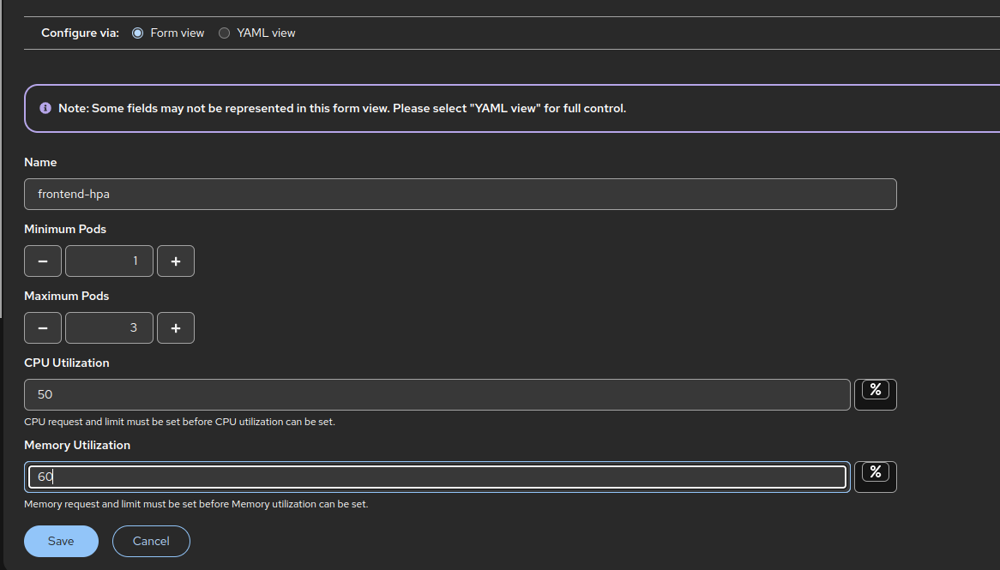

# SRE and DevOps Lab

# Provision Openshift Container Platform resources on AWS using Terraform

## Overview

This Terraform infrastructure provisions a OpenShift Container Platform cluster on AWS. The configuration deploys vpc, iam, security groups, route53.

## Directory Structure

```
terraform-ocp-infra
├── main.tf
├── modules
│   ├── iam
│   │   ├── main.tf
│   │   ├── outputs.tf
│   │   └── variables.tf
│   ├── route53
│   │   ├── main.tf
│   │   ├── outputs.tf
│   │   └── variables.tf
│   ├── security-groups
│   │   ├── main.tf
│   │   ├── outputs.tf
│   │   └── variables.tf
│   └── vpc
│       ├── main.tf
│       ├── outputs.tf
│       └── variables.tf
├── outputs.tf
├── terraform.tfstate
├── terraform.tfvars
├── variables.tf
└── versions.tf
```

## Root Configuration Files

### Main Configuration Files

| File | Purpose |
|------|---------|
| `main.tf` | Primary configuration orchestrating all modules |
| `variables.tf` | Global variable definitions for the entire infrastructure |
| `outputs.tf` | Exposed values from the infrastructure deployment |
| `terraform.tfvars` | Variable value assignments and environment-specific configurations |
| `providers.tf` | AWS provider configuration with region and authentication settings |
| `versions.tf` | Terraform and provider version constraints |

## Infrastructure Modules

### 1. VPC Module (`modules/vpc/`)

**Purpose**: Creates the network infrastructure for the OpenShift cluster.

**Components Provisioned**:
- Virtual Private Cloud (VPC) with custom CIDR ranges
- Public and private subnets across multiple Availability Zones
- Internet Gateway for public subnet internet access
- NAT Gateways for private subnet outbound connectivity
- Route tables with appropriate routing rules

### 2. Security Groups Module (`modules/security-groups/`)

**Purpose**: Implements network security controls for all cluster components.

**Security Groups Created**:
- **Master Node Security Group**: Controls access to OpenShift control plane
- **Worker Node Security Group**: Manages traffic to compute nodes
- **Load Balancer Security Group**: Secures external traffic ingress

### 3. IAM Module (`modules/iam/`)

**Purpose**: AWS Identity and Access Management roles and policies for OpenShift cluster operation.

**IAM Resources Created**:
- **OpenShift installer IAM**: Openshift Installer IAM roles
---

# Provision Openshift Container Platform

## Overview
We have completed creating all the necessary resources on aws using terraform in the previous tasks. To provision openshift cluster we need to create a `install-config.yaml` file which will be consumed by the `openshift-installer` to provision your cluster.

```
compute:
- hyperthreading: Enabled
  name: worker
  platform:
    aws:
      type: m5.large
  replicas: 3
```
```
platform:
    aws:
      type: m5.xlarge
  replicas: 3
```
Above are some of the important fields which are part of the `install-config.yaml`. We also need to provide our `pull-secret` obtained from the RedHat console and our `ssh-key-pair`.

Once you have the config ready you can start provisioning your cluster using the command: `openshift-install create cluster --dir=ocp-install --log-level=info`

# GitOps for K8s Application Deployment

## Overview

Implemented complete GitOps workflow using Openshift GitOps Operator. The deployement was done using app of apps pattern in a declarative manner.

## Directory Structure

```
gitops
├── bootstrap
│   └── app-of-apps.yaml
└── charts
    └── microservice-app.yaml
```

## Deployment Manifests

### 1. `bootstrap/app-of-apps.yaml`

**app-of-apps** pattern allows you to manage multiple ArgoCD applications through a single parent Application.

```
  source:
    repoURL: 'https://github.com/doflamingo721/sre-devops-lab.git'
    targetRevision: main
    path: gitops/charts
  destination:
    server: 'https://kubernetes.default.svc'
    namespace: openshift-gitops
```
The `repoURL` is out github repository where our ArgoCD application is present.
The `targetRevision` tells us the branch to use.
The `path` specifies the path to your ArgoCD Application yaml.
The `destination.server` is the url of your kubernetes service

### 2. `charts/microservices-app.yaml`

```
  source:
    repoURL: 'https://github.com/doflamingo721/microservices-demo.git'
    targetRevision: main
    path: helm-chart
  destination:
    server: 'https://kubernetes.default.svc'
    namespace: microservices-demo
```
The `repoURL` is out github repository where our ArgoCD application is present.
The `targetRevision` tells us the branch to use.
The `path` specifies the path to your application helm chart.
The `destination.server` is the url of your kubernetes service
The `namespace` tells us where the application is going to be deployed.

# CI Pipeline with GitHub Actions

This GitHub Actions workflow automatically builds, scans, and pushes a Docker image for the frontend application whenever code is pushed to the main branch.

Please find the workflow here: https://github.com/doflamingo721/microservices-demo/blob/main/.github/workflows/build-push.yaml

## Overview
The workflow performs the following steps:

1. **Code Checkout** - Retrieves the latest code from the repository
2. **Docker Setup** - Configures Docker Buildx for advanced build features
3. **Authentication** - Logs into DockerHub using stored credentials
4. **Image Build** - Creates a Docker image locally without pushing
5. **Security Scan** - Scans the built image for vulnerabilities using Trivy
6. **Image Tagging** - Tags the image for DockerHub repository
7. **Image Push** - Uploads the final image to DockerHub

## Prerequisites
The following secrets must be configured in your GitHub repository:

`DOCKERHUB_USERNAME` - Your DockerHub username
`DOCKERHUB_TOKEN` - Your DockerHub access token

## Image Scanning

```
- name: Scan image with Trivy
  uses: aquasecurity/trivy-action@0.28.0
  with:
    image-ref: frontend:temp
    format: table
    exit-code: 0
    ignore-unfixed: true
```

The above stage scans the image stored by buildex and scans it using trivy. It gives an output of the CVEs found in that image. The `exit-code: 0` signifies that the build should not fail incase any critical CVEs are detected.

## Image Building

```
- name: Build Docker image (local only)
  uses: docker/build-push-action@v5
  with:
    context: ./src/frontend
    file: ./src/frontend/Dockerfile
    push: false
    tags: frontend:temp
    load: true
```

The above stage builds the image from the Dockerfile present at `./src/frontend/`. It does not push the image and loads it locally with the `load: true` flag.

## Image Push

```
- name: Tag image for DockerHub
  run: docker tag frontend:temp doflamingo721/frontend:latest

- name: Push image to DockerHub
  run: docker push doflamingo721/frontend:latest
```

The above tags the `frontend:temp` image as `yourreponame:tag` and then pushes the image to your repository.

# Autoscaling

Autoscaling is implemented for the frontend deployment based on CPU and Memory consumption:



To generate the load, we have loadgenerator service deployed as part of the sock-shop application.

```
- name: USERS
  value: "10"
- name: RATE
  value: "1"
```
Change the above values in the loadgenerator deployment template in the sock-shop helm chart to generate more load. You can also increase the replica count for generating load from simultaenous pods.

# Multus CNI Configuration

## Overview

Multus CNI plugin allows kubernetes pods to have multiple network interfaces.
- First is the openshift default interface : OVN-Kubernetes
- Secondary networks (with Multus) can be of type bridge, macvlan, host-device.
- These are defined using NAD (NetworkAttachmentDefinition) objects.

## `/k8s-manifests/nad.yaml`

```
  config: '{
    "cniVersion": "0.3.1",
    "type": "bridge",
    "bridge": "br0",
    "isGateway": true,
    "ipam": {
      "type": "static",
      "subnet": "10.10.0.0/24",
      "routes": [],
      "rangeStart": "10.10.0.10",
      "rangeEnd": "10.10.0.20",
      "gateway": "10.10.0.1"
    }
  }'
```

Above is a NAD object configuration which tells us `cniVersion`, `type` of of CNI plugin and `ipam`. 
With the above config A Linux bridge interface is created on the host. Pod gets a static IP from the specified range. Gateway (10.10.0.1) is used for pod outbound traffic on that interface.

## Example flow of traffic:

We have 3 app manifests in the /k8s-manifests directory. 2 of the deployment have additional interface.

Pod 1:

```
annotations:
  k8s.v1.cni.cncf.io/networks: '[{
    "name": "bridge-net",
    "interface": "net1",
    "ips": ["10.10.0.11/24"]
  }]'
```

Pod 2:
```
annotations:
  k8s.v1.cni.cncf.io/networks: '[{
    "name": "bridge-net",
    "interface": "net1",
    "ips": ["10.10.0.12/24"]
  }]'
```

Both are connected to bridge on the same node and hence can ping each other via net1.

